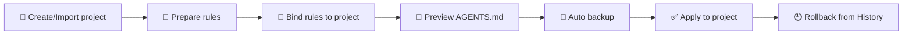

<div align="center">


# VT Hub Manager

**A local desktop workspace for AI coding tools**
Manage project contexts, rules, skills, and presets across Codex / Claude / Cursor — all in one place

[](https://vuejs.org/)
[](https://www.typescriptlang.org/)
[](https://vitejs.dev/)
[](https://tauri.app/)
[](https://www.rust-lang.org/)
[](https://pnpm.io/)
[](#-requirements)

[中文](./README.md) ｜ 🌐 **English**

</div>

---

> 🪄 In one sentence: pull the **project context, rules, skills, and provider configs** that are scattered across your AI tools into a single local desktop app — with preview, backup, and rollback for every write.

Built with **Vue 3 + TypeScript + Tauri 2 + Rust**. All data lives in `~/.vt-agent-hub/` on your machine. No online service required.

---

## 📑 Table of Contents

- [🎯 Who it's for](#-who-its-for)
- [✨ Core features](#-core-features)
- [🤖 Supported AI tools](#-supported-ai-tools)
- [🛠 Requirements](#-requirements)
- [🚀 Quick start](#-quick-start)
- [📜 Scripts](#-scripts)
- [🧭 Basic workflow](#-basic-workflow)
- [💾 Where data lives](#-where-data-lives)
- [🗂 Project structure](#-project-structure)
- [❓ FAQ](#-faq)
- [🤝 Development & contributing](#-development--contributing)

---

## 🎯 Who it's for

| What you're doing…                                            | How this helps…                                              |
| ------------------------------------------------------------- | ------------------------------------------------------------- |
| 🧑‍💻 Using **Codex / Claude / Cursor** in parallel               | Keep their project context in sync                            |
| 🗂 Hopping between many local projects                         | Set up `AGENTS.md` and tool rules for each one in one click   |
| 🧠 Want to capture reusable prompts                            | Curate them as **Rules / Skills** and reuse across projects   |
| 🔑 Managing multiple model providers                           | Maintain many configs (model / base URL / token), switch fast |
| 🛟 Worried about tools rewriting your config files             | Every write is **previewed, backed up, and rollback-ready**   |

---

## ✨ Core features

### 📁 Project management

- Create and import local projects, or **import directly from a Git repo**
- Maintain independent rule bindings per project
- Preview the `AGENTS.md` that will be written to the project
- One-click **Apply / Repair / Cleanup / Reset** project output, with automatic backup

### 📜 Rule management

- Create, edit, and delete rules
- Import rules from a local Markdown file or a repository
- Categorize and reorder rules
- Bind a rule to a **single project** or to a tool's **global** context
- Preview the impact before changing — see which projects and tools are affected

### 🧩 Skill management

- Create, edit, and delete skills
- Import skills from a **GitHub repository** (with conflict detection and rename)
- Install a skill into a specific AI tool runtime
- install / uninstall / repair / mark stale state operations

### ⚙️ Preset (provider) management

- Maintain multiple provider configurations (name, category, website, notes)
- Per-tool settings: model, reasoning parameters, base URL, credential reference
- Parse and import a provider from pasted config text
- Preview the diff that will be written to the tool's real config file
- Apply to the live tool runtime, and detect drift against it

### 🔐 Tool & credential management

- See each tool's install state, version, and health
- Save, verify, and clear tool credentials
- Credentials live in the **system keychain / credential store**, never in plain-text config files
- Repair tool configurations

### 🕘 History & backups

- See every write / import / repair operation
- Browse automatic backups — **preview a diff, restore, or delete** any of them
- Export diagnostics for troubleshooting

### 🪄 First-run import

- On startup, scan `~/.codex` and `~/.claude` for existing rules, skills, and providers
- Pick what to import, choose conflict strategies, choose how credentials are handled

### 🎨 UI

- 🌍 Chinese / English language switch
- 🌗 Light / dark / follow system
- ⌘ Command palette for quick navigation
- 📌 Project dock to switch current project fast

---

## 🤖 Supported AI tools

| Tool       | Status       | Rules | Presets | Credentials | Skill install | Project AGENTS.md |
| ---------- | ------------ | :---: | :-----: | :---------: | :-----------: | :---------------: |
| 🟢 Codex   | ✅ Enabled   |  ✅   |   ✅    |     ✅      |      ✅       |        ✅         |
| 🟣 Claude  | ✅ Enabled   |  ✅   |   ✅    |     ⛔      |      ⛔       |        ✅         |
| 🟠 Cursor  | 🚧 Planned   |  ✅   |   ⛔    |     ⛔      |      ⛔       |        ✅         |

> The table mirrors the tool capabilities declared in the Rust backend (`src-tauri/src/core/tool_registry.rs`). Cursor will be enabled in a later release.

---

## 🛠 Requirements

| Dependency        | Version    | Notes                                                          |
| ----------------- | ---------- | -------------------------------------------------------------- |
| 🟩 Node.js        | ≥ 22       | Frontend build and scripts                                     |
| 📦 pnpm           | ≥ 10       | Package manager                                                |
| 🦀 Rust           | stable     | Tauri backend                                                  |
| 🖥 Tauri 2 deps   | see docs   | [Tauri prerequisites](https://tauri.app/start/prerequisites/)  |

Install pnpm:

```bash
npm install -g pnpm
```

---

## 🚀 Quick start

```bash
# 1️⃣  Clone the repo
git clone https://github.com/twj0415/vt-agent-hub.git
cd vt-agent-hub

# 2️⃣  Install dependencies
pnpm install

# 3️⃣  Start the desktop app in dev mode (Vite + Tauri together)
pnpm tauri:dev
```

🎉 On first launch:

1. The app creates a local storage directory at `~/.vt-agent-hub/` (database, asset library, backups, logs, etc.).
2. If rules / skills / providers are detected under `~/.codex` or `~/.claude`, a **first-run import** dialog appears.
3. Pick what to import and choose a conflict strategy — you're ready to go.

> 💡 Want frontend-only debug (no Tauri backend)?
>
> ```bash
> pnpm dev   # Vite at http://127.0.0.1:24220
> ```

---

## 📜 Scripts

```bash
pnpm dev               # 🧪 Start the Vite dev server (frontend only)
pnpm tauri:dev         # 🖥  Start the Tauri desktop dev mode
pnpm build             # 📦 Type-check and build the frontend (dist/)
pnpm typecheck         # ✅ TypeScript type checking only
pnpm test              # 🔬 Run Vitest frontend unit tests
pnpm tauri             # 🛠 Pass through to the Tauri CLI
pnpm tauri:build:nsis  # 🪟 Build a Windows NSIS installer
```

Rust backend tests:

```bash
cd src-tauri
cargo test
```

---

## 🧭 Basic workflow



### 1️⃣ Create or import a project

- Open the **Projects** page
- Click **New project** or **Import from Git**
- Choose the project type and provide a local path or Git URL

### 2️⃣ Prepare your rules

- Go to **Assets → Rules**
- Create a rule or **import from a local file / repository**
- Categorize and reorder

### 3️⃣ Bind rules to the project

- Go back to **Projects** and select your project
- Open the **rule binding** drawer and pick the rules you want
- Choose the target tool (Codex / Claude)

### 4️⃣ Preview and apply `AGENTS.md`

- On the project card, click **Preview output** to see the full diff of the `AGENTS.md` that will be written
- Confirm and click **Apply**
- A backup is saved automatically to `~/.vt-agent-hub/backups/` before the write

### 5️⃣ Configure a provider (optional)

- Go to **Assets → Presets**
- Create a provider with name, model, and base URL
- Enter your token — it goes to the system credential store, never to the database in plain text
- Pick the target tool, preview the diff, then **Apply to the live tool config**

### 6️⃣ Install a skill (optional)

- Go to **Assets → Skills**
- Create a skill or import one from a GitHub repository
- Pick the target tool and click **Install**

### 7️⃣ Troubleshoot and roll back

- Open **History** to see every operation
- Open **Settings → Maintenance** to browse backups
- Any backup can be **diff-previewed and restored** with one click

### 8️⃣ Switch language and theme

- Open **Settings → Appearance & Language**
- Switch between **Chinese / English**
- Switch between **Light / Dark / Follow system**

---

## 💾 Where data lives

All user data lives under `~/.vt-agent-hub/`:

```text
~/.vt-agent-hub/
├── 🗃  app.db        # SQLite database (projects, rules, skills, providers, etc.)
├── 📚 library/      # Asset library (rules, skills, etc.)
├── 💾 backups/      # Automatic backups before any write
├── 📝 logs/         # Operation logs
├── 📸 snapshots/    # Data snapshots
└── 🧰 runtime/      # Tool runtime assets
```

> 🔐 Credentials (tokens, etc.) live in the **system credential manager** and are **never written to `app.db` or any config file in plain text**.

You can redirect the data directory with environment variables:

| Env var                          | Purpose                                        |
| -------------------------------- | ---------------------------------------------- |
| `VT_HUB_MANAGER_STORAGE_ROOT`    | Override the default `~/.vt-agent-hub` root    |
| `VT_HUB_MANAGER_CODEX_ROOT`      | Override the default `~/.codex` path           |
| `VT_HUB_MANAGER_CLAUDE_ROOT`     | Override the default `~/.claude` path          |
| `VT_HUB_MANAGER_CURSOR_ROOT`     | Override the default `~/.cursor` path          |

---

## 🗂 Project structure

```text
.
├── 🎨 src/                # Frontend source
│   ├── app/              # Bootstrap, router, theme, global styles
│   ├── features/         # Cross-page feature modules (first-run import, repo import, etc.)
│   ├── pages/            # Main pages: projects / tools / rules / skills / presets / history / settings
│   └── shared/           # API, components, stores, i18n, utilities, types
├── 🦀 src-tauri/          # Tauri / Rust backend
│   ├── src/
│   │   ├── adapters/        # Per-tool adapters
│   │   ├── application/     # Application services
│   │   ├── commands/        # Tauri command layer
│   │   ├── core/            # Constants, paths, tool registry, status codes
│   │   ├── domain/          # Domain objects
│   │   ├── dto/             # Frontend / backend DTOs
│   │   └── infrastructure/  # SQLite, repositories, migrations, asset stores
│   ├── Cargo.toml
│   └── tauri.conf.json
├── 📦 package.json
├── 🔒 pnpm-lock.yaml
└── ⚙️  vite.config.ts
```

---

## ❓ FAQ

<details>
<summary><strong>❓ Why hasn't the app written anything to my project?</strong></summary>

Every write goes through a **preview + confirm** step. Files are only written after you click Apply, and a backup is created first.

</details>

<details>
<summary><strong>❓ Will my data survive upgrades?</strong></summary>

Yes. The database is upgraded automatically through the migrations under `infrastructure/migrations/`. Older data is migrated in order to the new schema.

</details>

<details>
<summary><strong>❓ Can I manage multiple projects and tools at the same time?</strong></summary>

Yes. Rules can be bound to a **single project** or to a tool's **global** context, and the two never interfere.

</details>

<details>
<summary><strong>❓ Where are tokens stored?</strong></summary>

In the system credential manager (Windows Credential Manager, macOS Keychain, etc.). The database only holds a reference to the credential.

</details>

<details>
<summary><strong>❓ How do I fully reset the app?</strong></summary>

Open **Settings → Maintenance** and use **Reset app data**. This is irreversible, so export diagnostics or back up anything important first.

</details>

---

## 🤝 Development & contributing

Before submitting a change, run:

```bash
pnpm typecheck                 # ✅ TypeScript type checking
pnpm test                      # 🔬 Frontend unit tests
cd src-tauri && cargo test     # 🦀 Rust backend tests
```

- 🦀 Rust code follows the default `cargo fmt` / `cargo clippy` style
- 🎨 Frontend code is formatted with the repo-level `.prettierrc`

Issues and pull requests are welcome 🙌

---

<div align="center">

Made with ❤️ for AI coding workflows

</div>
